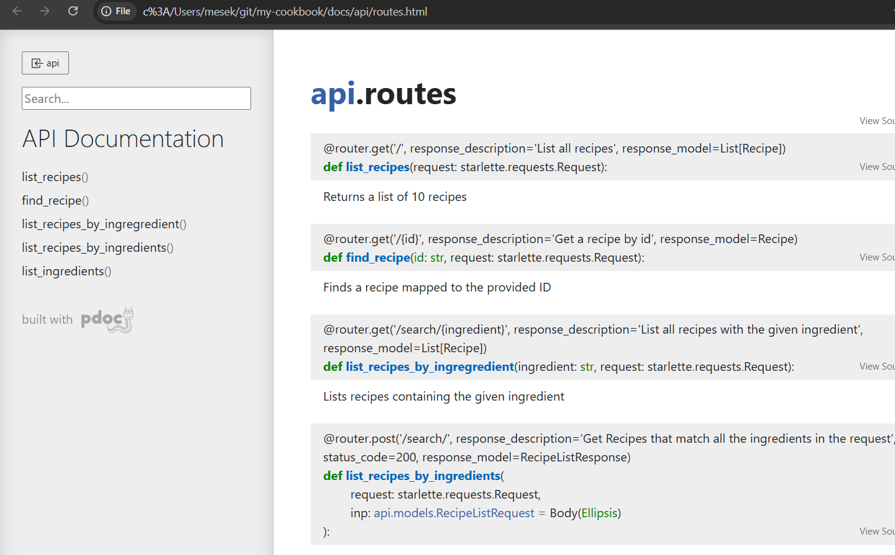
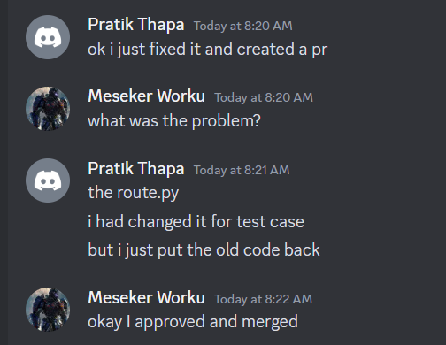
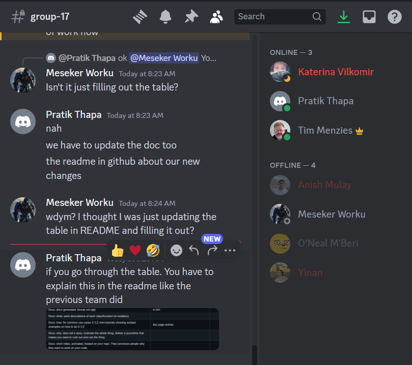
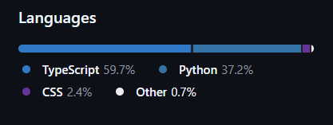
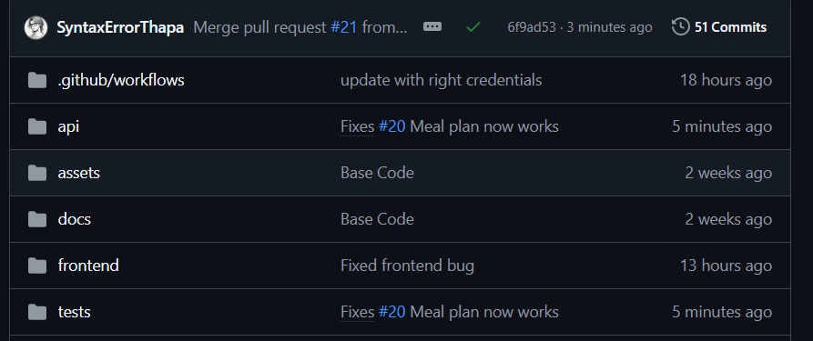
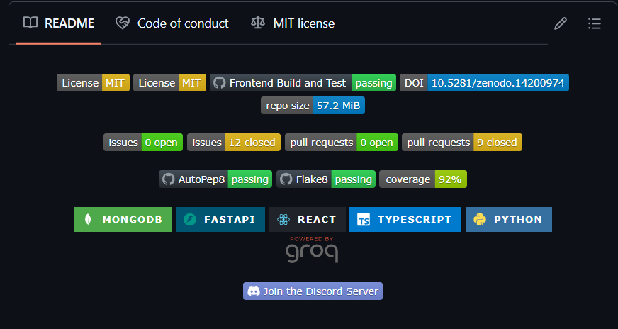

<div align="center">

[](https://opensource.org/licenses/MIT)
[](https://github.com/ncsu-csc-510/Project3/actions/workflows/build.yml)
[](https://doi.org/10.5281/zenodo.14200973)
[](https://github.com/ncsu-csc-510/Project3)


[](https://coveralls.io/github/ncsu-csc-510/Project3)


<a href="https://groq.com" target="_blank" rel="noopener noreferrer">
  
</a>

</div>

<p align="center"></p>

<!--[](https://discord.gg/jqCNWqET) -->

## Table of Contents

- [What is My Cookbook?](#-what-is-my-cookbook)
- [Why Choose My Cookbook?](#-why-choose-my-cookbook)
- [What’s New & Key Features](#-whats-new--key-features)
  - [New in This Release](#new-in-this-release)
  - [Future Roadmap](#future-roadmap)
- [Project Demo Video](#-project-demo-video)
- [Better Software Design](#-better-software-design)
- [Access the Website](#-access-the-website)
- [Installations](#-installations)
- [Examples](#examples)
- [Style Checker and Code Formatter](#style-checker-and-code-fomatter)
- [Code Coverage](#code-coverage)
- [Meet the Team](#meet-the-team)
- [Support](#support)

# 🍳 What is My Cookbook?

**My Cookbook** is a **revolutionary AI-powered meal planning assistant** that simplifies your cooking routine and transforms your kitchen experience. Whether you're a busy individual or a culinary enthusiast, My Cookbook combines intelligent recipe matching, personalized meal planning, nutrition tracking, and interactive cooking features to keep you organized and inspired.

### Highlights

- **AI-Powered Recipe Recommendations**: Get daily meal ideas tailored to your dietary preferences and cooking habits.  
- **Personalized Meal Planning**: Create weekly meal plans with a simple drag-and-drop calendar.  
- **Hands-Free Interactive Cooking Mode**: Use voice guidance and built-in timers to follow step-by-step recipes without touching your device.  
- **Recipe Customization & Scaling**: Adjust servings with an intuitive slider; ingredient quantities and nutritional facts recalculate automatically.
  
With CookBook, you'll never run out of cooking inspiration again! 🥗🍜🍰  

---

# 🤔 Why Choose My Cookbook?

Most of us have faced these situations:

1. **Craving something delicious**, but unsure of what to cook.  
2. **Staring at your pantry**, uncertain how to use the ingredients you already have.  
3. Wanting to try something **new and exciting**, but needing guidance or easy instructions.

### How My Cookbook Solves These Problems

- **Ingredient-Based Recipes**: Enter the ingredients you have, and **My Cookbook** finds recipes to match—minimizing food waste.  
- **Voice-Guided Instructions**: Hands-free navigation with timers keeps your cooking smooth and accessible to all skill levels.  
- **Detailed Nutrition Tracking**: Track macros and essential vitamins to meet dietary goals. 

CookBook isn’t just a tool—it’s your cooking companion, saving time and bringing creativity to your kitchen! 🍲✨  

---
  
</p><br><br>

 # 🚀What's New?

## New features:
### 1. **AI-Powered Recipe Matching**
- Tailors suggestions to your cooking history and saved favorites.  
- Seasonal and trending recipes appear automatically in daily suggestions.

### 2. **Enhanced Personalized Meal Planning**
- Build a customized weekly meal plan based on dietary preferences, available ingredients, and desired cooking time.  
- Drag-and-drop calendar for effortless organization.  
- Auto-generated shopping lists to simplify grocery trips.

### 3. **Hands-Free Interactive Cooking Mode**
- Real-time, **voice-guided** recipe walkthrough.  
- Visual timers and spoken instructions for a smooth cooking flow.

### 4. **Recipe Customization & Scaling**
- Adjust servings with an intuitive slider.  
- Automatic recalculation of ingredient quantities and nutrition facts.  
- Perfect for cooking for one or hosting a large dinner party.

### 5. **Serving Slider & Interactive Voice Mode**
- A new UI slider for easy portion adjustment.  
- Interactive voice-based cooking mode to keep your hands free and your focus on the dish.
  
With CookBook, cooking becomes an adventure. What will you create today? 🥘👨‍🍳👩‍🍳  
---

## Future Roadmap

> **Version I+1: Looking Ahead**

- **Recipe Personalization**  
  - Incorporate user ratings/feedback for more accurate personalization over time.  
  - Auto-adjust recipe cooking times if you consistently cook faster or slower.

- **Social Features**  
  - Share recipes or adopt others’ meal plans for group dinners and potlucks.  
  - Invite loved ones to comment or replicate your weekly plan.

- **Smart Kitchen Integration**  
  - Link your My Cookbook account to smart appliances (e.g., ovens, Instant Pots) for automated temperature and time settings.  
  - Receive reminders when you’re running low on common staples.

- **Advanced Analytics**  
  - Dive deeper into your cooking history—spot patterns in sugar intake, protein consumption, etc.  
  - Get budget-friendly tips or alerts on sales for frequently used ingredients.

> **Powering Precision**: *120+ Test Cases* ensure unmatched reliability in every release!

---

## 🎥[Project3 Demo Video](https://drive.google.com/file/d/1aWom-LHXEbFp1CCc7HRJSVN7eAw5oOHb/view?usp=sharing)

# 🚀 Better Software Design

My Cookbook is designed with **scalability**, **safety**, and **reliability** in mind. We use modern solutions such as:

- **CDN & Load Balancing**: Faster content delivery and improved availability.  
- **SSL/TLS & DDoS Protection**: Secure data transfer and protection against malicious attacks.  
- **Caching**: Reduces latency and speeds up your recipe searches.  

For a more detailed breakdown, see our [Scalability](docs/Scalability.md) and [Safety](docs/Safety.md) documentation.

---

# 🌐 Access the Website  

Access CookBook directly via this link: [Cook Book](https://cookbook-alpha.vercel.app/).  

### 🛠️ Troubleshooting  
If the page fails to load, you can try the following:  
- Switch to a different network environment (e.g., home network or mobile hotspot).  
- Some users may experience DNS resolution failures under NC State's network due to DNS server issues.  

If problems persist, follow the installation instructions below to run CookBook locally.  

---

# 🛠️Installations  

## Prerequisites  
Before setting up the project, ensure you have the following installed:  
- **[MongoDB](https://www.mongodb.com/products/platform/cloud)**: Create a cluster and generate the DB URL, username, and password.  
- **[GROQ](https://groq.com/)**: Create an API key.  
- **Create a `.env` file** in the `api` folder with the following details:  
```env
ATLAS_URI = ...
DATABASE = cookbook
GROQ_API_KEY = ...
PORT = 8000

```
*   [Docker](https://docs.docker.com/get-docker/)
*   [Docker Compose](https://docs.docker.com/compose/install/)
*   (Optional) [Python 3.11](https://www.python.org/downloads/) and [pytest 7.4.4](https://docs.pytest.org/) for testing the API
*   (Optional) [Node.js](https://nodejs.org/en/download/) and [npm](https://docs.npmjs.com/cli/v7/commands/npm) for frontend testing

## 📊 Dataset
You can find the dataset used for this project [here](https://drive.google.com/file/d/12CZFb7Ugmiw9zQ7M_qpRsn7pmaV1zW0c/view?usp=sharing)

## 🔧 Backend Installation

Follow these steps to set up and run the backend server:

1. **Navigate to the API folder**:
   ```bash
   cd api
   
2. **Install required dependencies**:
    ```bash
    pip install -r requirements.txt

3. **Run the application server**:
   ```bash
   python -m uvicorn main:app --reload


### 🛠️Trouble Shooting

In case you run into any issues running the above commands, some operating systems may require you to use `python3` instead of `python` and `pip3` instead of `pip`.<br><br>

## 🎨Frontend Installation

To set up the front end React app, do:
1. **Navigate to the frontend folder**:
   ```bash
   cd frontend

   
2. **Install required dependencies**:
    ```bash
    npm install

3. **If the above command fails, use the following alternative:**:
   ```bash
   npm install --legacy-peer-deps
   
4. **Start the React app:**
   ```bash
   npm start

## ✨ New Functions 

### Improved UI & Login


---

### 🖼️ Generating Personalized Meal Plan  


---

### 📝 Meal Plan generated in a Calendar View


---

### 🛒 Meal Plan Creation using Drag & Drop

  

---

### 🍝 Automatic Export of Ingredients to a Shopping List

  

---

### 🤝 User History & Activity based AI created recipes  


---

### New & Improved Recipe Viewer


---

### 🖼️ Interactive Voice Activated Cooking Mode


---

<!--## Old Functions
- This is the CookBook HomePage that should automatically open in a browser after executing the command: 'npm start'
  <br><br>


<br>

- The user can use the search bar to enter the ingredients one by one, and then proceed by clicking the arrow on the right.
  <br><br>


<br>

- The user would then be redirected to the page showing the recipe suggestions.
  <br><br>


<br>

- The details of a recipe can be viewed by simple clicking on a recipe from the list of recipes being displayed.
  <br><br>


<br><br>


- Start the App by URL.


<br>


- Above content mentions that users may manually input keyword, and click on 'search tag' to create some keyword search tags to search recepies. Besides, users may also click on some "food tags" to search receipes without specific input. For example, we may select "milk" tag:


<br>

- Then, we may have results shown as below:


<br>

- What is more, if users are not sure that tags to be chosen, they are able to use sliders to set some values for [Calorie, Fat, Suger, Protain]. The filtered recepies will be shown after using this kind of search. For example, if we want receipes that fulfill some requirements as:


<br>

- As former example cases, filtered results are displayed:


<!--
# Style Checker and Code Fomatter

- IDE and Style Checker: [VSCode](https://code.visualstudio.com/)

- Code Style Formatter: [Beautify](https://marketplace.visualstudio.com/items?itemName=HookyQR.beautify)

- Code Syntax Checker : [Eslint](https://https://marketplace.visualstudio.com/items?itemName=dbaeumer.vscode-eslint) for Vscode plugin.

Following extensions have to be added to you VS Code editor:

- For Eslint: Install - dbaeumer.vscode-eslint
- For Prettier: Install - esbenp.prettier-vscode
- Update the settings.json of your VS Code editor to include these statements (you can add them to your existing ones):

```bash

{
  "editor.defaultFormatter": "esbenp.prettier-vscode",
  "eslint.alwaysShowStatus": true,
  "editor.formatOnSave": true,
  "editor.codeActionsOnSave": {
    "source.fixAll.eslint": true
  },
  "[json]": {
    "editor.defaultFormatter": "esbenp.prettier-vscode",
    "editor.formatOnSave": true
  }
}

```-->

# Code Coverage for 6.0


# Meet the Team

## Version 6
- Aniruddha Kulkarni
- Anchal Kakadia
- Aranya Venugopal

## Version 5
<center>
  <table>
    <tr>
      <td align="center">
        <a href="https://github.com/SyntaxErrorThapa">
          <br />
          <sub><b>Pratik Thapa</b></sub>
        </a><br />
      </td>
      <td align="center">
        <a href="https://github.com/MesekerWK">
          <br />
          <sub><b>Meseker Worku Kebede</b></sub>
        </a><br />
      </td>
      <td align="center">
        <a href="https://github.com/ONeal2467">
          <br />
          <sub><b>O'Neal M'Beri</b></sub>
        </a><br />
      </td>
    </tr>
  </table>
</center>

## Version 4
<center>
  <table>
    <tr>
      <td align="center">
        <a href="https://github.com/SoundaryaKhanapur">
          <br />
          <sub><b>Soundarya Khanapur</b></sub>
        </a><br />
      </td>
      <td align="center">
        <a href="https://github.com/mugdhaajoshi">
          <br />
          <sub><b>Mugdha Joshi</b></sub>
        </a><br />
      </td>
      <td align="center">
        <a href="https://github.com/Jing27540">
          <br />
          <sub><b>Jing Huang</b></sub>
        </a><br />
      </td>
    </tr>
  </table>
</center>

## Version 3
- Akshay Ashutosh Dongare
- Anish Mulay
- Ashwattha Phatak
- 


## Version 2.x
- Pinxiang Wang
- Yuheng Zhu
- Mengzhe Wang
- Jiayuan Huang
- Yiran Zhu

## Version 1.0


<!--
# Support
You can find the dataset used for this project [here](https://drive.google.com/file/d/12CZFb7Ugmiw9zQ7M_qpRsn7pmaV1zW0c/view?usp=sharing)
### 📊 Score Card for Version 5
#### Total Grade: 102/105

|Notes|Evidence|Score|
|-----|---------|--|
|Workload is spread over the whole team (one team member is often Xtimes more productive than the others... --| https://github.com/ncsugroup17/my-cookbook/graphs/contributors |3
but nevertheless, here is a track record that everyone is contributing a lot)|evidence in GH (above link )| 3
|Number of commits|in GH https://github.com/ncsugroup17/my-cookbook/graphs/contributors | 3
|Number of commits: by different people|in GH https://github.com/ncsugroup17/my-cookbook/graphs/contributors| 3
|Issues reports: there are **many**| https://github.com/ncsugroup17/my-cookbook/issues | 3
|Issues are being closed|evidence in GH https://github.com/ncsugroup17/my-cookbook/issues?q=is%3Aissue%20state%3Aclosed | 3
|Docs: doco generated, format not ugly |in GH https://github.com/ncsugroup17/my-cookbook/tree/main/docs/api| 3|
|Docs: what: point descriptions of each class/function (in isolation)|  | 3 |
|Docs: how: for common use cases X,Y,Z mini-tutorials showing worked examples on how to do X,Y,Z|doc page entries (not sure what this asks for) | 0| |
|Docs: why: docs tell a story, motivate the whole thing, deliver a punchline that makes you want to rush out and use the thing|Why write docs? Because every great recipe needs a story. Your API isn't just code—it's the secret sauce that powers your project. With pdoc, you can transform your Python scripts into a beautifully crafted cookbook of knowledge, ready to inspire collaboration and innovation. **Punchline**: Your code feeds the machine, but your docs feed the team. Let’s make them hungry to use it! | 3
|Docs: short video, animated, hosted on your repo. That convinces people why they want to work on your code.| https://youtu.be/fWfs_Mxc5CQ | 3
|Use of version control tools|https://github.com/ncsugroup17/my-cookbook/network | 3
|Test cases exist|dozens of tests and those test cases are more than 30% of the code base https://coveralls.io/github/ncsugroup17/my-cookbook?branch=main| 3 |
|Test cases are routinely executed|E.g. travis-com.com or github actions or something https://github.com/ncsugroup17/my-cookbook/actions| 3 |
|Issues are discussed before they are closed|even if you discuss in slack, need a sumamry statement here | 3 |
|Chat channel: exists|Link or screenshots |3 |
|Test cases: a large proportion of the issues related to handling failing cases.|If a test case fails, open an issue and fix it https://github.com/ncsugroup17/my-cookbook/issues/12| 3 |
|Evidence that the whole team is using the same tools: everyone can get to all tools and files|  | 3
|Evidence that the whole team is using the same tools (e.g. config files in the repo, updated by lots of different people)| Added to the packago.json https://github.com/ncsugroup17/my-cookbook/pull/1/files| 3
|Evidence that the whole team is using the same tools (e.g. tutor can ask anyone to share screen, they demonstrate the system running on their computer)| Only Pratik and Meseker could run it | 3
|Evidence that the members of the team are working across multiple places in the code base| We worked on backend APIs, frontend, and tests | 3
|Short release cycles | (hard to see in short projects) project members are committing often enough so that everyone can get your work our commit history https://github.com/ncsugroup17/my-cookbook/commits/main/| 3|
|The file .gitignore lists what files should not be saved to the repo. See [examples]i(https://github.com/github/gitignore)|in GH (ROOT directory) | 3|
|The file INSTALL.md lists how to install the code|in GH(Root directory)|3 |
|The file LICENSE.md lists rules of usage for this repo|in GH (Root directory)|3 |
|The file CODE-OF-CONDUCT.md lists rules of behavior for this repo; e.g. see [example](https://github.com/probot/template/blob/master/CODE_OF_CONDUCT.md)|in GH (root directory)|3 |
|The file CONTRIBUTING.md lists coding standards and lots of tips on how to extend the system without screwing things up; e.g. see [example](https://github.com/probot/template/blob/master/CONTRIBUTING.md)|in GH (root directory)|3 |
|The file README.md contains all the following|in GH| 3|
|Video|2min video of new functionality, showing a significant delta from prior. https://youtu.be/fWfs_Mxc5CQ| 3 |
|DOI badge: exists. To get a Digitial Object Indentifier, regiser the project at [Zenodo](https://docs.github.com/en/repositories/archiving-a-github-repository/referencing-and-citing-content). DOI badges look like this:  |in GH | 3 |
|Badges showing your style checkers |config files in GH showing your config, badges in README | 3|
|Badges showing your code formatters. |config files in GH showing your this formatter's  config, badges in README | 3|
|Badges showing your syntax checkers. |config files iin  GH showing this checker's config, badges in README  | 3|
|Badges showing your code coverage tools|config files in GH, badges in README | 3 |
|Badges showing any other Other automated analysis tools|config files in GH, badges in README | 3|


### 📊 Score Card
#### Total Grade: 151

| Factor | Score | Notes |
| --- | --- | --- |
| Video | 3 | https://youtu.be/Tk9iwPMeQhA?si=6ZQWc6nXfInSZTet |
| Workload | 3 | Distributed |
| Number of commits | 3 | 50+ |
| Number of commits: by different people | 3 |https://github.com/Software-Engineering-2024-Group/my-cookbook/graphs/contributors |
| Issues report: There are many | 3 | https://github.com/Software-Engineering-2024-Group/my-cookbook/issues |
| Issues are being closed | 3 | https://github.com/Software-Engineering-2024-Group/my-cookbook/issues?q=is%3Aissue+is%3Aclosed|
| DOI badge | 3 | https://zenodo.org/records/14200974 |
| Docs: format | 3 | https://github.com/Software-Engineering-2024-Group/my-cookbook/blob/main/.github/workflows/autopep8.yml |
| Docs: description  | 3 | https://github.com/Software-Engineering-2024-Group/my-cookbook |
| Docs: short animated video | 3 |  |
| Docs: strong punchlines | 3 | https://github.com/Software-Engineering-2024-Group/my-cookbook |
| Docs: mini tutorials | 3 | https://github.com/Software-Engineering-2024-Group/BurnoutExtreme/blob/master/Tutorials.md#signup-and-sign-in |
| Use of version control tools | 3 | https://github.com/Software-Engineering-2024-Group/my-cookbook/blob/main/.github/workflows/autopep8.yml |
| Use of style checkers | 3 | https://github.com/Software-Engineering-2024-Group/BurnoutExtreme/blob/master/.github/workflows/autopep8.yml |
| Use of code formatters. | 3 | https://github.com/Software-Engineering-2024-Group/my-cookbook/blob/main/.github/workflows/flake8.yml |
| Use of syntax checkers. | 3 | https://github.com/Software-Engineering-2024-Group/my-cookbook?tab=readme-ov-file#style-checker-and-code-fomatter |
| Use of code coverage | 3 | https://coveralls.io/github/Software-Engineering-2024-Group/my-cookbook?branch=main |
| Other automated analysis tools | 2 | https://github.com/Software-Engineering-2024-Group/my-cookbook/blob/main/.github/workflows/build.yml |
| Test cases exist | 3 | https://github.com/Software-Engineering-2024-Group/my-cookbook/tree/main/tests |
| Test cases are routinely executed | 2 | https://github.com/Software-Engineering-2024-Group/my-cookbook/tree/main/tests |
| The files http://contributing.md/ lists coding standards and lots of tips | 3 |  |
| Issues are discussed before they are closed | 3 | https://github.com/Software-Engineering-2024-Group/my-cookbook/issues |
| Chat channel: exists | 3 | whatsapp, discord(https://discord.gg/4zmAMZNY) |
| Test cases: a large proportion of the issues related to handling failing cases. | 3 | https://github.com/Software-Engineering-2024-Group/my-cookbook/issues |
| Evidence that the whole team is using the same tools | 3 |  |
| Evidence that the members of the team are working across multiple places in the code base | 3 | https://github.com/Software-Engineering-2024-Group/my-cookbook/pulse |
| Short release cycles | 3 |  |
| Does your website and documentation provide a clear, high-level overview of your software? | 3 | https://github.com/Software-Engineering-2024-Group/my-cookbook |
| Does your website and documentation clearly describe the type of user who should use your software? | 3 | https://github.com/Software-Engineering-2024-Group/my-cookbook |
| Do you publish case studies to show how your software has been used by yourself and others? | 3 |  |
| Is the name of your project/software unique? | 3 | https://github.com/Software-Engineering-2024-Group/my-cookbook |
| Is your project/software name free from trademark violations? | 3 |  |
| Is your software available as a package that can be deployed without building it? | 3 | https://github.com/Software-Engineering-2024-Group/my-cookbook |
| Is your software available for free? | 3 | https://github.com/Software-Engineering-2024-Group/my-cookbook |
| Is your source code publicly available to download, either as a downloadable bundle or via access to a source code repository? | 3 | https://github.com/Software-Engineering-2024-Group/my-cookbook |
| Is your software hosted in an established, third-party repository like GitHub? | 3 |  |
| Is your documentation clearly available on your website or within your software? | 3 |  |
| Does your documentation include a "quick start" guide, that provides a short overview of how to use your software with some basic examples of use? | 3 | https://github.com/Software-Engineering-2024-Group/my-cookbook |
| If you provide more extensive documentation, does this provide clear, step-by-step instructions on how to deploy and use your software? | 3 |  |
| Do you provide a comprehensive guide to all your software’s commands, functions and options? | 3 | https://github.com/Software-Engineering-2024-Group/my-cookbook |
| Do you provide troubleshooting information that describes the symptoms and step-by-step solutions for problems and error messages? | 3 |  |
| If your software can be used as a library, package or service by other software, do you provide comprehensive API documentation? | 3 |https://github.com/Software-Engineering-2024-Group/my-cookbook/blob/main/INSTALL.md |
| Do you store your documentation under revision control with your source code? | 2 |  |
| Do you publish your release history e.g. release data, version numbers, key features of each release etc. on your web site or in your documentation? | 3 |  |
| Does your software describe how a user can get help with using your software? | 3 |  |
| Does your website and documentation describe what support, if any, you provide to users and developers? | 3 | https://github.com/Software-Engineering-2024-Group/my-cookbook/blob/main/INSTALL.md |
| Does your project have an e-mail address or forum that is solely for supporting users? | 3 |  |
| Are e-mails to your support e-mail address received by more than one person? | 3 |  |
| Does your project have a ticketing system to manage bug reports and feature requests? | 2 | https://github.com/Software-Engineering-2024-Group/my-cookbook/issues |
| Is your project's ticketing system publicly visible to your users, so they can view bug reports and feature requests? | 3 | https://github.com/Software-Engineering-2024-Group/my-cookbook/issues |


```
CookBook
├─ .DS_Store
├─ .git
│  ├─ COMMIT_EDITMSG
│  ├─ FETCH_HEAD
│  ├─ HEAD
│  ├─ ORIG_HEAD
│  ├─ branches
│  ├─ config
│  ├─ description
│  ├─ hooks
│  │  ├─ applypatch-msg.sample
│  │  ├─ commit-msg.sample
│  │  ├─ fsmonitor-watchman.sample
│  │  ├─ post-update.sample
│  │  ├─ pre-applypatch.sample
│  │  ├─ pre-commit.sample
│  │  ├─ pre-merge-commit.sample
│  │  ├─ pre-push.sample
│  │  ├─ pre-rebase.sample
│  │  ├─ pre-receive.sample
│  │  ├─ prepare-commit-msg.sample
│  │  ├─ push-to-checkout.sample
│  │  ├─ sendemail-validate.sample
│  │  └─ update.sample
│  ├─ index
│  ├─ info
│  │  └─ exclude
│  ├─ logs
│  │  ├─ HEAD
│  │  └─ refs
│  │     ├─ heads
│  │     │  ├─ deployment
│  │     │  ├─ feature
│  │     │  │  ├─ sharing
│  │     │  │  └─ voice
│  │     │  ├─ main
│  │     │  └─ testing
│  │     └─ remotes
│  │        └─ origin
│  │           ├─ HEAD
│  │           ├─ deployment
│  │           ├─ feature
│  │           │  ├─ custom-recipe
│  │           │  ├─ sharing
│  │           │  └─ voice
│  │           ├─ main
│  │           └─ testing
│  ├─ objects
│  │  ├─ 05
│  │  │  └─ e0965be70269e9d0e80b4a7abcd19cee5045aa
│  │  ├─ 0b
│  │  │  └─ 3319b88eb440710814e313a0a0ec5af41a83cc
│  │  ├─ 0d
│  │  │  └─ ff004f27b6e45498cbf98849a09a1a6af9874c
│  │  ├─ 0e
│  │  │  └─ 94498776b5f0afd22be43a380e9ecbac725047
│  │  ├─ 12
│  │  │  └─ dfb43a249310457988157ac56bcf7ee1156374
│  │  ├─ 1c
│  │  │  └─ 9c24ec1a7f026f7cef4fb6f8abb431d4079fc5
│  │  ├─ 1d
│  │  │  └─ 0b4eb0ad5ea8fa4f2fa85fbf3b281dbb1b41b7
│  │  ├─ 1f
│  │  │  └─ 885a64eb4ad8eacb492ce1da01b557b23b19b5
│  │  ├─ 21
│  │  │  └─ b395ebc3bc7eaba702fa32badf955b2ea69958
│  │  ├─ 23
│  │  │  └─ a58ac52d9211d707e1ac0ec484736c5809bc2e
│  │  ├─ 27
│  │  │  └─ bc5baa52acca8ad0f3a0321a0957458de1675e
│  │  ├─ 28
│  │  │  └─ e92174ac0219af02b7f9a124f54a4e46a4f3a6
│  │  ├─ 2a
│  │  │  └─ 02c6a9003c06e0eb63232bca3d526a95c93095
│  │  ├─ 2b
│  │  │  └─ 79db553eecee4bea5cacd328834d8705b45aa7
│  │  ├─ 2c
│  │  │  ├─ 20e3def01cf18f20987259a3d859b4aa8f5f9d
│  │  │  └─ ee3a95364a8844f0433e5213c4c7b22e66f80f
│  │  ├─ 2d
│  │  │  └─ 9a284218a2ef36de0897f8bd40d9ba9fd2743a
│  │  ├─ 33
│  │  │  └─ 89e18869d320d3a1b5dc4b4f6aaa2ba3688c90
│  │  ├─ 35
│  │  │  └─ 5047b0ddb8cea63068b0ccd64b9365cfa2df9c
│  │  ├─ 38
│  │  │  └─ 5df5b7d9247910d69f0ecc50c8a5e2be19f8c7
│  │  ├─ 3a
│  │  │  └─ d62964ed81b6697f6c7218a6c9ca5fe8a7a351
│  │  ├─ 3b
│  │  │  └─ 302566fe62c27c8ce825f6d64286cd011e213d
│  │  ├─ 3f
│  │  │  └─ 2367dc9f0bf3a4cc7f2d42b5b485a2932115d2
│  │  ├─ 43
│  │  │  └─ 9ada9155dd5c1da0181bf8e6e071cb5c435e35
│  │  ├─ 45
│  │  │  ├─ 08d6f2117f9bd57e21e482f675817c60e30078
│  │  │  ├─ eecb95e928111642f35a0fda1e9fb35f84dc87
│  │  │  └─ eeeea6f81bf2451b45891eb49852b2d6d79c0f
│  │  ├─ 4e
│  │  │  └─ b258465db79cd4771e33ed907371c5a334f480
│  │  ├─ 4f
│  │  │  └─ 1142f5630b93c095998e437e1a2bd20b607e94
│  │  ├─ 50
│  │  │  └─ 12b8fc470a0bfbce2cec7238e7a351a76ce7fc
│  │  ├─ 55
│  │  │  └─ 17db073566a2a557375d6ddb9ddafb488cc5c9
│  │  ├─ 56
│  │  │  └─ 465aec48cfe99f1102b7fd68f95ea016edebe0
│  │  ├─ 57
│  │  │  ├─ 8c8a608d48133177e145cbf2e59f9acbe1d21e
│  │  │  └─ cef333e32cc136fe715103bf37c9100197ec79
│  │  ├─ 5a
│  │  │  └─ 3eee8dac34dbbc230490e664670d49e9a24490
│  │  ├─ 5b
│  │  │  └─ ebb86cf4099e14503daaad9d8d3ef0446611cf
│  │  ├─ 5e
│  │  │  └─ c9021186b01b24c9adb84708079f58151a3e03
│  │  ├─ 62
│  │  │  └─ 49314f7b1d3a425b459964d54a49a6e1802601
│  │  ├─ 63
│  │  │  └─ 7b7f066d93d871872fab0654a371e02ac415b1
│  │  ├─ 64
│  │  │  └─ 0e0ef369946319891bbf6f37c7c803faafa516
│  │  ├─ 73
│  │  │  └─ fe86be6ada884538f65e3d8e55048cd254a797
│  │  ├─ 7c
│  │  │  └─ 31b0872a6fe49e72423d3ad7017a71eba0570b
│  │  ├─ 82
│  │  │  └─ 2df5e946e036b77730d86d6476b4d8819820e1
│  │  ├─ 84
│  │  │  └─ 03357d66ff432d5d5a3cfb0f0322104d379f83
│  │  ├─ 86
│  │  │  └─ fd607e06ed348d5a51318fddbb937548cc6e4c
│  │  ├─ 88
│  │  │  └─ 7b8d72e8c2d7422b0376bd37b16391176e8b00
│  │  ├─ 89
│  │  │  └─ 708ed1661d80ecc4010ba346df8207d06de455
│  │  ├─ 8a
│  │  │  └─ 71c83e5df64559b56e7af5e25f8d357b4b9e07
│  │  ├─ 8e
│  │  │  └─ 45ca7105f3836da20768d67a35c5c5ffc64bb5
│  │  ├─ 8f
│  │  │  ├─ 8a4a71e58a1e2c164c0b73a1ee623e6ed424a6
│  │  │  └─ baeca88855919dd266975e786a7269e55eba3c
│  │  ├─ 92
│  │  │  └─ c6daa84c49571b9aa61281c88ee210ead16e08
│  │  ├─ 93
│  │  │  └─ d8ccb1f59ef71e7b233dd34e4e2f117e42452a
│  │  ├─ 94
│  │  │  └─ 76207bb81ee44dbafad15cfb50de1a51283bc4
│  │  ├─ 95
│  │  │  └─ 08aac5b04a69782dfbeac1630ea7d57fbe26b3
│  │  ├─ 96
│  │  │  └─ 9129c099b42928c06cd01035067eca7facf56b
│  │  ├─ 97
│  │  │  └─ fc547d726b2ea87da271952e03fa659b4d75a8
│  │  ├─ 98
│  │  │  └─ 05126010b269bf288173db7623eaebc27ca1f1
│  │  ├─ 9c
│  │  │  └─ 997bee6ba58d20dcf3c678eebe1017d0c888e7
│  │  ├─ 9e
│  │  │  └─ 1dc1c0085312c944af86e3777e14eb88430b5c
│  │  ├─ a0
│  │  │  └─ 505556f638908eed62296a05ea19a9016bdd54
│  │  ├─ a5
│  │  │  └─ 9bbd4ded2aff28877e486141ed444419061b1d
│  │  ├─ a6
│  │  │  └─ f9da8d99465ec2b09e9af5adb984cd576bdb8a
│  │  ├─ a8
│  │  │  └─ 7d925906dd12e0e33d9bdb4ad50303a20928af
│  │  ├─ aa
│  │  │  └─ 42eb78e014d5916c16853d7713e591ed878178
│  │  ├─ ac
│  │  │  └─ 2f6c8814a74213fff124db7aabbc88ec3b3846
│  │  ├─ ae
│  │  │  └─ 2e39f23f2834d54a5d18dbc90e3cda3d00d201
│  │  ├─ af
│  │  │  ├─ 5706c29b537769ed01b173e62c12c7a09f255e
│  │  │  └─ f0407fa24f199085fc2ca399cd04698dab9dc1
│  │  ├─ b0
│  │  │  └─ d4d2e31be48d5245abc85a94052adc7111cadb
│  │  ├─ b2
│  │  │  └─ ee1df41a9ef6394b7c4f2832e436eee822ae2a
│  │  ├─ b4
│  │  │  └─ 43203e19ff74b71be21af72474e6033867d62e
│  │  ├─ b6
│  │  │  └─ ca86dacf42818d6f5e199d925db43676e62f85
│  │  ├─ ba
│  │  │  ├─ 0974b2e7a07a77153f9c777cfdd4b5251104b3
│  │  │  └─ 5c9c50582c1141dd237337321105cb9bcf1c30
│  │  ├─ be
│  │  │  └─ 1cdc8366f2b7562308ec152a69a774e0d62589
│  │  ├─ bf
│  │  │  └─ 2266d1193d4b0369743b2074054bf0e446e95f
│  │  ├─ c2
│  │  │  ├─ 6e9936d970b54f8e422c7538735bad3a93ff32
│  │  │  └─ cb2b753ec6664caceee8a6c2079243ee19bd6a
│  │  ├─ c4
│  │  │  └─ c35c40fc479461d898bbf13a3294b588870404
│  │  ├─ c9
│  │  │  └─ e9ef1c2e1fb2337c263cd33095573e91c932c2
│  │  ├─ cd
│  │  │  └─ 735018cba96ad337385e3666ea395f83e889ab
│  │  ├─ cf
│  │  │  └─ f3fc8f9916aa6ea1b4b97237168ca0bca71048
│  │  ├─ d2
│  │  │  └─ 40aa4500e7c05b0a475cf57115abb4c3ee49a1
│  │  ├─ d6
│  │  │  └─ ddd185635923c19a76d0a38bd66de0874399d4
│  │  ├─ db
│  │  │  ├─ 289e152c510a1feaa873bfcfcbc71afb548192
│  │  │  ├─ 2fb59dac5993906dbf0d712d9c28c0a867ee08
│  │  │  └─ 574e4410c6139964f7097e9483f6e18a1e80a7
│  │  ├─ dd
│  │  │  └─ c3e50fa76cf9f43532b6d9170f8b8abf9dd341
│  │  ├─ e1
│  │  │  └─ f5461b9a857e1592e6ead0387e856a9572239f
│  │  ├─ e2
│  │  │  └─ 624a1ef480ff481ea9355ae657e3f59e38386d
│  │  ├─ e4
│  │  │  └─ 6c17f5660215efa2296bc8842abdc3df74e6b8
│  │  ├─ e6
│  │  │  └─ 2c7589183ccaecccd1f603d02abe68ec51fea7
│  │  ├─ e7
│  │  │  ├─ 712e1b3fc982c63bf3900f167db4a128b99fcb
│  │  │  └─ 98ae6feeefec68ff154574fe6ee8b85c6badf9
│  │  ├─ ea
│  │  │  └─ 39a3ed6c9af3449f26a82a265ce23b53273b67
│  │  ├─ ee
│  │  │  └─ 50c4157b92ba1a5ed5b7f84cc0173cdb878626
│  │  ├─ ef
│  │  │  └─ d3b43ad008caac2176b0cc00a809df69c0ae27
│  │  ├─ f6
│  │  │  └─ 0368f89ab89ac1c06cd8a7ecedcc157b3ec588
│  │  ├─ fa
│  │  │  ├─ 81f02fff8948545949813a00a39eabaaadd9e6
│  │  │  └─ d083da3df884b22975a34cf43dad821edb56a5
│  │  ├─ fb
│  │  │  └─ 58b6fcd36eb073621a612501f45ec4d39d162f
│  │  ├─ fc
│  │  │  └─ 3efe393c5ef63c5dd47335eecf0497cbac209a
│  │  ├─ info
│  │  └─ pack
│  │     ├─ pack-120a108bc00379b2f122869f8014cfe85126262e.idx
│  │     ├─ pack-120a108bc00379b2f122869f8014cfe85126262e.pack
│  │     └─ pack-120a108bc00379b2f122869f8014cfe85126262e.rev
│  ├─ packed-refs
│  └─ refs
│     ├─ heads
│     │  ├─ deployment
│     │  ├─ feature
│     │  │  ├─ sharing
│     │  │  └─ voice
│     │  ├─ main
│     │  └─ testing
│     ├─ remotes
│     │  └─ origin
│     │     ├─ HEAD
│     │     ├─ deployment
│     │     ├─ feature
│     │     │  ├─ custom-recipe
│     │     │  ├─ sharing
│     │     │  └─ voice
│     │     ├─ main
│     │     └─ testing
│     └─ tags
├─ .github
│  └─ workflows
│     ├─ node.js.yml
│     ├─ python-app.yml
│     └─ workflow.yml
├─ .gitignore
├─ CITATION.cff
├─ CODE_OF_CONDUCT.md
├─ CONTRIBUTING.md
├─ LICENSE
├─ README.md
├─ api
│  ├─ Dockerfile
│  ├─ __init__.py
│  ├─ main.py
│  ├─ models.py
│  ├─ requirements.txt
│  └─ routes.py
├─ assets
│  ├─ HomePage.PNG
│  ├─ HomePage_new.png
│  ├─ RecipeDetails.PNG
│  ├─ SearchBar.PNG
│  ├─ SearchResults.PNG
│  ├─ codecov.png
│  ├─ demo.gif
│  ├─ filterSearch1.png
│  ├─ filterSearch2.png
│  ├─ logo.png
│  ├─ tagSearch1.jpg
│  ├─ tagSearch2.jpg
│  ├─ team_edit.png
│  ├─ video1.m4v
│  └─ video2.m4v
├─ docker-compose.yml
├─ docs
│  ├─ Home.css
│  ├─ Safety.md
│  ├─ Scalability.md
│  ├─ api
│  │  ├─ main.html
│  │  ├─ models.html
│  │  └─ routes.html
│  ├─ api.html
│  ├─ components.html
│  ├─ images
│  │  ├─ 4a08d1b7-15a5-0eed-0f9f-0c0337f05c03.jpg
│  │  ├─ 8750c800-0485-f790-5fdc-5a8cf409301e.jpg
│  │  ├─ SSL.png
│  │  ├─ cache.png
│  │  ├─ cdn.png
│  │  ├─ e6fab1f1-ae30-31cf-b73f-aa548e18d0f4.jpg
│  │  ├─ fgfgfg4.jpg
│  │  ├─ load.png
│  │  ├─ load_balancing.png
│  │  ├─ screenshot1.png
│  │  └─ screenshot2.png
│  ├─ index.html
│  ├─ jquery.js
│  ├─ nicepage.css
│  ├─ nicepage.js
│  ├─ proj1rubric.md
│  ├─ proj1rubricComments.pdf
│  ├─ proj2rubric.md
│  ├─ search.js
│  └─ style
│     ├─ accordian.pack.js
│     └─ style.css
├─ frontend
│  ├─ .eslintignore
│  ├─ .eslintrc.json
│  ├─ .gitignore
│  ├─ .prettierignore
│  ├─ .prettierrc.json
│  ├─ .vscode
│  │  └─ settings.json
│  ├─ Dockerfile
│  ├─ README.md
│  ├─ package-lock.json
│  ├─ package.json
│  ├─ public
│  │  ├─ favicon.ico
│  │  └─ index.html
│  ├─ src
│  │  ├─ App.css
│  │  ├─ App.test.tsx
│  │  ├─ App.tsx
│  │  ├─ features
│  │  │  ├─ AppContent
│  │  │  │  ├─ AppContent.tsx
│  │  │  │  ├─ HomePage
│  │  │  │  │  ├─ AboutPage.tsx
│  │  │  │  │  ├─ ContactPage.tsx
│  │  │  │  │  ├─ HomePage.css
│  │  │  │  │  ├─ HomePage.test.tsx
│  │  │  │  │  ├─ HomePage.tsx
│  │  │  │  │  └─ photos
│  │  │  │  │     ├─ eighth.jpg
│  │  │  │  │     ├─ fifth.jpg
│  │  │  │  │     ├─ first.jpg
│  │  │  │  │     ├─ fourth.jpg
│  │  │  │  │     ├─ logo.png
│  │  │  │  │     ├─ nineth.jpg
│  │  │  │  │     ├─ second.jpg
│  │  │  │  │     ├─ seventh.jpg
│  │  │  │  │     ├─ sixth.jpg
│  │  │  │  │     ├─ tenth.jpg
│  │  │  │  │     └─ third.jpg
│  │  │  │  ├─ NutritionFilter
│  │  │  │  │  └─ CustomizedAccordions.tsx
│  │  │  │  ├─ RecipeInformation
│  │  │  │  │  ├─ RecipeInformation.css
│  │  │  │  │  ├─ RecipeInformation.test.tsx
│  │  │  │  │  ├─ RecipeInformation.tsx
│  │  │  │  │  ├─ getRecipeInformation.action.ts
│  │  │  │  │  ├─ getRecipeInformation.actionTypes.ts
│  │  │  │  │  ├─ getRecipeInformation.reducer.ts
│  │  │  │  │  ├─ getRecipeInformation.saga.ts
│  │  │  │  │  └─ no-image.png
│  │  │  │  ├─ RecipeList
│  │  │  │  │  ├─ RecipeList.css
│  │  │  │  │  ├─ RecipeList.tsx
│  │  │  │  │  ├─ getRecipeList.action.ts
│  │  │  │  │  ├─ getRecipeList.actionTypes.ts
│  │  │  │  │  ├─ getRecipeList.reducer.ts
│  │  │  │  │  └─ getRecipeList.saga.ts
│  │  │  │  └─ Tag
│  │  │  │     ├─ GetTags.tsx
│  │  │  │     ├─ TagList.css
│  │  │  │     ├─ getTagList.action.ts
│  │  │  │     ├─ getTagList.actionTypes.ts
│  │  │  │     ├─ getTags.reducer.ts
│  │  │  │     └─ getTags.saga.ts
│  │  │  ├─ GetIngredients
│  │  │  │  ├─ GetIngredients.tsx
│  │  │  │  ├─ getIngredients.action.ts
│  │  │  │  ├─ getIngredients.actionTypes.ts
│  │  │  │  ├─ getIngredients.reducer.ts
│  │  │  │  └─ getIngredients.saga.ts
│  │  │  ├─ Header
│  │  │  │  ├─ Header.css
│  │  │  │  ├─ Header.test.tsx
│  │  │  │  └─ Header.tsx
│  │  │  ├─ Navbar
│  │  │  │  ├─ Navbar.css
│  │  │  │  ├─ Navbar.test.tsx
│  │  │  │  └─ Navbar.tsx
│  │  │  ├─ apiMethods.ts
│  │  │  ├─ features.reducer.ts
│  │  │  └─ features.saga.ts
│  │  ├─ fonts
│  │  │  ├─ Roboto-Regular.ttf
│  │  │  └─ Roboto-Thin.ttf
│  │  ├─ index.css
│  │  ├─ index.tsx
│  │  ├─ logo.svg
│  │  ├─ react-app-env.d.ts
│  │  ├─ reportWebVitals.ts
│  │  ├─ setupTests.ts
│  │  └─ store.ts
│  └─ tsconfig.json
└─ tests
   ├─ .env
   ├─ coverage.xml
   ├─ sliderCollections.tsx
   └─ test_routes.py 
   -->

```
